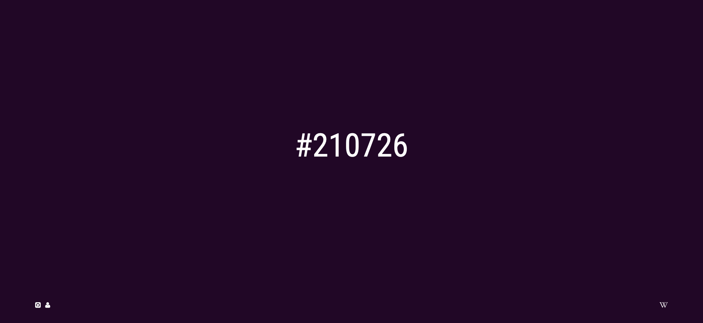

# hexclock

A [hexadecimal clock](https://davidherszenhaut.github.io/hexclock/) that changes color with each passing second.

  

hexclock works by taking the current time (HH:MM:SS) and combining those values into a six digit color code. Each second, the background color changes to reflect the change in time.

[hexclock](https://davidherszenhaut.github.io/hexclock/)
